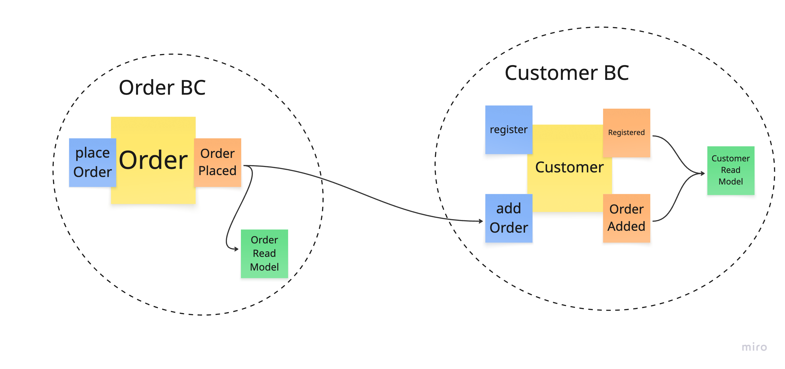

# Event-Sourced DDD with Axon and Kafka — Orders & Customers Demo

A multi-service event-driven architecture using Event-Sourced DDD Aggregates from the **Axon Framework** with **Kafka** for inter-service event-based communication and **PostgreSQL** for Axon Event Store and Read Model Projections.

## Architecture Overview



The system is built around two independent bounded contexts:

- **Order Bounded Context** (order-service) — Handles order placement and maintains order data
- **Customer Bounded Context** (customer-service) — Manages customers and tracks orders they placed

## Services

- **order-service** — Handles order placement (port 8081)
- **customer-service** — Manages customers (port 8082)
- **Kafka** — Event streaming between services
- **PostgreSQL** — Two databases: one for orders (port 5434), one for customers (port 5433)

## Prerequisites

- **Java 21**
- **Docker** + **Docker Compose**
- **Maven** (bundled via `mvnw`)

---

## Quick Start

## Prerequisites

- Java 21
- Docker & Docker Compose
- Maven
- IntelliJ IDEA (recommended for HTTP requests)

## Running the Application

### 1. Start Infrastructure

```bash
docker compose up
```

This starts:
- PostgreSQL (customers) on port 5433
- PostgreSQL (orders) on port 5434
- Kafka on port 9092

### 2. Start Services

Start the Order Service:
```bash
cd order-service
mvn spring-boot:run
```

Start the Customer Service (in a new terminal):
```bash
cd customer-service
mvn spring-boot:run
```

The services run on:
- Order Service: http://localhost:8081
- Customer Service: http://localhost:8082

### 3. Test the Application

#### Step 1: Register a Customer

Use `requests/customer.http`:

```http
POST http://localhost:8082/customers/register
Content-Type: application/json

{
  "name": "Oliver Zihler"
}
```

The response will include the customer ID, which is automatically stored in the HTTP client environment (`{{customerId}}`).

Response:
```json
{
  "id": "e6686671-7de9-45fb-8a02-b449db20dc6e",
  "name": "Oliver Zihler",
  "orderIds": []
}
```

#### Step 2: Place an Order

Use `requests/orders.http` - the `{{customerId}}` is automatically used from the previous request:

```http
POST http://localhost:8081/orders?customerId={{customerId}}&amount=12.5
```

The order ID is returned and automatically stored as `{{orderId}}`.

The order event will be:
1. Published to Kafka by Order Service (`OrderPlacedEvent`)
2. Consumed by Customer Service
3. Processed as a command to add the order ID to the customer (`AddOrderCommand`)
4. Stored as an event (`OrderAddedEvent`)

#### Step 3: Get Order Details

Use the GET endpoint in `requests/orders.http`:

```http
GET http://localhost:8081/orders/{{orderId}}
```

Response:
```json
{
  "orderId": "4673006b-e505-493e-b28f-243dae359180",
  "customerId": "e6686671-7de9-45fb-8a02-b449db20dc6e",
  "amount": 12.5,
  "title": "Order 12.5"
}
```

#### Step 4: Verify the Customer Data

Use the GET endpoint in `requests/orders.http`:

```http
GET http://localhost:8082/customers/{{customerId}}
```

Response:
```json
{
  "id": "e6686671-7de9-45fb-8a02-b449db20dc6e",
  "name": "Oliver Zihler",
  "orderIds": [
    "4673006b-e505-493e-b28f-243dae359180"
  ]
}
```

Note: The customer only stores order IDs. To get full order details (amount, title), query the Order Service using the order ID.

## Architecture

### Services

- **Order Service**:
  - Manages order aggregates using Event Sourcing
  - Creates orders and publishes `OrderPlacedEvent` to Kafka
  - Maintains SQL projections with order details (orderId, customerId, amount, title)
  - Provides REST API to query order details

- **Customer Service**:
  - Manages customer aggregates using Event Sourcing
  - Consumes order events from Kafka
  - Stores only order IDs in customer projections (no amount/title duplication)
  - Maintains SQL projections in PostgreSQL
  - Provides REST API with subscription queries for eventual consistency

### Infrastructure

- **Kafka**: Event bus for inter-service communication
- **PostgreSQL**:
  - Event store (domain_event_entry table)
  - SQL projections:
    - Order Service: `orders` table (orderId, customerId, amount, title)
    - Customer Service: `customers` table + `customer_orders` table (only orderIds)

### Key Patterns

- **Event Sourcing**: Aggregate state is reconstructed from events
- **CQRS**: Separate write model (aggregates) and read model (projections)
- **Subscription Queries**: REST endpoints wait for projections to be updated before returning
- **Event-Driven Architecture**: Services communicate via Kafka events
- **Bounded Contexts**: Each service maintains its own projections with different data models
  - Order Service owns order details (amount, title)
  - Customer Service only references orders by ID
